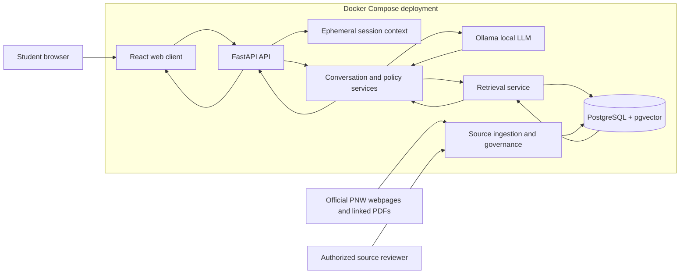
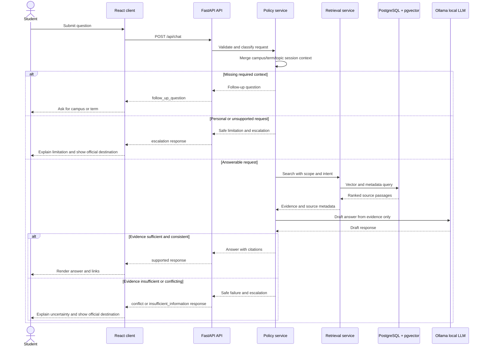

# Implementation Plan: PNW Student Information Chatbot

**Branch**: `001-pnw-information-chatbot` | **Date**: 2026-09-16 | **Spec**: `/specs/001-pnw-information-chatbot/spec.md`

**Input**: Feature specification from `/specs/001-pnw-information-chatbot/spec.md`

## Summary

Build a student-facing web chatbot for Purdue University Northwest information requests using a grounded retrieval workflow. The backend will serve as a source-aware Q&A system with FastAPI, PostgreSQL with pgvector, and a source-citation pipeline; the frontend will be a React UI that supports simple multi-turn follow-up questions, campus/term scope prompts, and safe fallback messaging. The initial release will be a public web experience hosted on an official PNW page, with ephemeral chat sessions and no transcript retention.

## Architecture

### Major Components and Interactions

- **React web client**: Presents the chat interface, maintains the active
  conversation context in the browser, displays answers and citations, and
  supports reset/new-topic actions. It does not persist transcripts.
- **FastAPI application**: Exposes the HTTP API, validates requests, manages
  short-lived session scope, coordinates retrieval and answer generation, and
  returns typed responses for supported answers, follow-up questions, conflicts,
  and escalations.
- **Conversation and policy services**: Classify intent, extract campus/term
  context, detect personalized or unsupported requests, enforce safe-failure
  behavior, and assemble the final student-facing answer with help from the
  local LLM.
- **Local LLM service**: Ollama running a freely available open-weight model
  such as `llama3.2:3b` provides language understanding and answer drafting
  without a paid hosted API. It may only use retrieved evidence supplied by the
  policy service and must not be treated as the source of university facts.
- **Retrieval service**: Generates a query representation, searches source
  chunks using PostgreSQL/pgvector, applies campus/term/status filters, and
  returns the evidence passages used to support an answer.
- **Source ingestion and governance service**: Imports official PNW webpages and
  linked PDF/documents, removes navigation/decorative content, extracts
  structured passages, records freshness metadata, and marks unavailable or
  conflicting sources for review.
- **PostgreSQL with pgvector**: Stores source documents, source chunks,
  embeddings, citations, escalation destinations, and operational metadata.
  Version 1 does not store chat transcripts.
- **Docker Compose deployment**: Runs the frontend, FastAPI backend, and
  PostgreSQL/pgvector services as reproducible containers behind the public PNW
  web entry point.



### Request Flow

1. The student submits a natural-language question through the React client.
2. FastAPI validates the request and associates it with the current ephemeral
   session context.
3. The policy service detects intent, extracts campus/term/program scope, and
   checks whether the request requires a personal record or binding decision.
4. If required context is missing, the API returns a focused follow-up question
   without generating a scope-specific answer.
5. Otherwise, the retrieval service searches active source chunks in pgvector,
   applying scope and freshness metadata.
6. The policy service evaluates whether the retrieved evidence is sufficient,
   current enough, and non-conflicting for the requested answer.
7. For sufficient evidence, the policy service sends only the question context
   and retrieved evidence to the local Ollama model to draft a concise answer.
8. The policy service validates the draft against the evidence and adds direct
   citations and relevant scope/freshness details.
9. For insufficient, conflicting, stale, or personalized requests, the service
   returns a safe limitation message and an escalation destination when known.
10. FastAPI returns the typed response to React, which renders the answer,
   citations, follow-up prompt, or escalation path.
11. The conversation context remains available only for the active session and is
    cleared when the user resets the chat or the session expires.



## Technical Context

**Language/Version**: Python 3.12, TypeScript 5.x, React 18, Node 20, Docker Compose

**Primary Dependencies**: FastAPI, Pydantic, SQLAlchemy, asyncpg, PostgreSQL 16, pgvector, React, Vite, Ollama with a free open-weight model such as `llama3.2:3b`, pytest, Vitest/RTL

**Storage**: PostgreSQL 16 with pgvector for source chunks and metadata; session state held in memory or a short-lived server-side session store; no transcript retention for v1

**Testing**: pytest for backend validation, Vitest/React Testing Library for frontend user flows, smoke tests for API contracts and safety behavior

**Target Platform**: Linux containerized deployment with browser access via Dockerized web app; Ollama runs locally in Docker or on the deployment host

**Project Type**: Web application (frontend + backend)

**Performance Goals**: p95 retrieval + local LLM answer generation under 10 seconds for common student questions; source lookup under 2 seconds for indexed corpus

**Constraints**: answers must be grounded in approved university sources; the free local LLM must receive retrieved evidence only; missing campus/term context must trigger a follow-up question; unsupported or conflicting information must trigger safe failure; no persistence of chat transcripts in version 1

**Scale/Scope**: Initial rollout for current Purdue Northwest students, curated approved sources, limited to public university information and referrals; not a personalized decision system

## Constitution Check

*GATE: Must pass before Phase 0 research. Re-check after Phase 1 design.*

- Grounded Answers: PASS — the plan keeps answer generation tied to approved university sources and links.
- Fail Safely: PASS — the system will explicitly ask for missing campus/term scope and avoid unsupported policy claims.
- Requirements Before Implementation: PASS — the feature specification contains reviewable requirements and clarifications.
- Testable Changes: PASS — the design includes validation through API smoke tests, answer safety tests, and frontend conversation scenarios.
- Maintainable and Transparent Engineering: PASS — the split between API, retrieval layer, source governance, and frontend keeps responsibilities explicit.

No constitution violations were identified.

The architecture preserves the constitution after design: source evidence and
citations remain explicit, unsupported requests have a safe response path,
ephemeral sessions avoid unrequired transcript collection, and the component
boundaries support focused automated and end-to-end tests.

## Project Structure

### Documentation (this feature)

```text
specs/001-pnw-information-chatbot/
├── plan.md              # This file (/speckit-plan command output)
├── research.md          # Phase 0 output (/speckit-plan command)
├── data-model.md        # Phase 1 output (/speckit-plan command)
├── quickstart.md        # Phase 1 output (/speckit-plan command)
├── contracts/           # Phase 1 output (/speckit-plan command)
└── tasks.md             # Phase 2 output (/speckit-tasks command - NOT created by /speckit-plan)
```

### Source Code (repository root)

```text
backend/
├── app/
│   ├── api/
│   ├── core/
│   ├── db/
│   ├── models/
│   ├── schemas/
│   ├── services/
│   └── tests/
├── Dockerfile
├── requirements.txt
└── pyproject.toml

frontend/
├── src/
│   ├── components/
│   ├── pages/
│   ├── services/
│   └── hooks/
├── public/
├── package.json
├── vite.config.ts
├── Dockerfile
└── tests/

compose.yaml
```

**Structure Decision**: Use a dual-app web architecture with a FastAPI backend and React frontend. PostgreSQL with pgvector is centralized in the same Docker environment to simplify retrieval and source metadata management.

## Complexity Tracking

No complexity violations were identified. The design is intentionally simple and aligns with the constitution’s maintainability and safety requirements.
