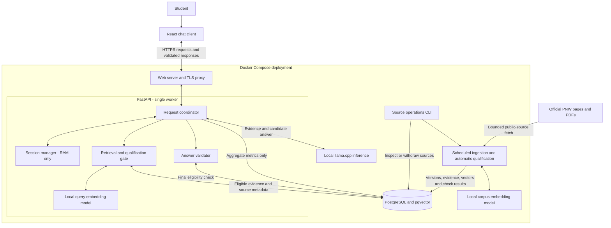
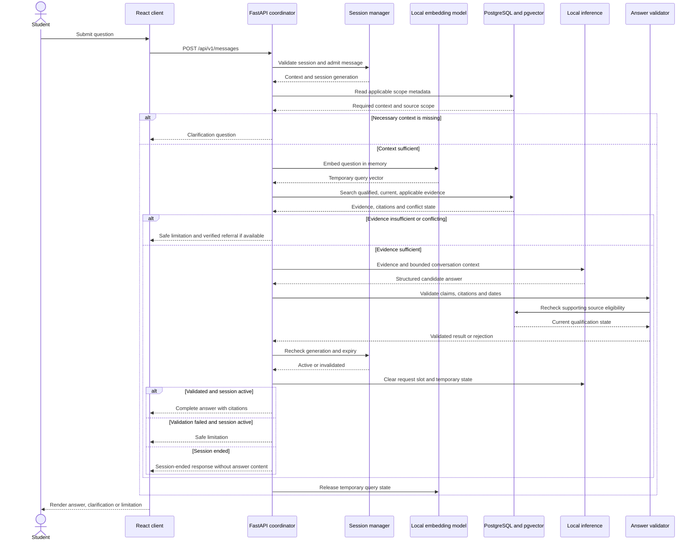

# Implementation Plan: PNW Student Information Chatbot

**Branch**: `001-pnw-student-chatbot` | **Date**: 2026-09-16 | **Spec**: [spec.md](spec.md)

**Input**: Feature specification from `specs/001-pnw-student-chatbot/spec.md` and user direction:
FastAPI, React, PostgreSQL with pgvector, Docker deployment.

## Summary

Build a grounded, informational PNW chatbot with a React chat interface and FastAPI API.
PostgreSQL/pgvector stores eligible university sources, structured evidence and governance;
active conversations stay in memory and are deleted on End chat or 30 minutes without a student
message. Local inference supports the retention constraint. Retrieval filters eligible,
applicable evidence, preserves source structure, and validates citations before returning a
complete answer. Unsupported or ambiguous questions receive clarification or safe refusal.

This command produces design documentation only. No application, migrations, containers or
model downloads have been created or deployed. The specification and design are aligned with constitution v2.0.0.

## Technical Context

**Language/Version**: Python 3.12; TypeScript with React 19; Node 22 for frontend build.

**Primary Dependencies**: FastAPI, Pydantic 2, SQLAlchemy 2, psycopg 3, Alembic, Vite,
Sentence Transformers, llama.cpp, Beautiful Soup and pypdf. Exact versions/digests pinned and
compatibility checked during implementation; research.md records model defaults.

**Storage**: PostgreSQL 17 with pgvector 0.8 (`vector(384)`) for university evidence, governance
and aggregate metrics only. API/browser RAM for active conversations. No Redis or transcript DB.

**Testing**: pytest for unit, PostgreSQL integration and HTTP contracts; Vitest/Testing Library
for React; Playwright for end-to-end, keyboard and retention journeys; human evidence scoring,
manual screen-reader review and load tests. Dependency/model fakes in CI; real-model release tests.

**Target Platform**: Linux Docker Compose host; modern desktop/mobile browsers. CPU development
profile and GPU inference benchmark profile. Same-origin HTTPS public endpoint.

**Project Type**: Web application with controlled source-operations CLI and scheduled ingestion.

**Performance Goals**: SC-006: 95% of evaluated requests finish within 10 seconds; internal
9-second request deadline. SC-003 answer correctness >=90% for answerable cases, with SC-001/002
zero unsupported claims and correct abstention across the evaluated set. All SC-001–008 apply.

**Constraints**: One API worker; no retained conversation content; 30-minute idle cutoff;
automated source/version qualification and source-backed term/session applicability; fail-safe behavior under outages;
no student records, transactions or personal degree decisions. Raw responses never stream before
validation. Inference has no outbound network requirement after model provisioning.

**Scale/Scope**: All FR-012 topics. Planning benchmark envelope: 200 active sessions, four
concurrent generations, 50,000 evidence blocks; single Linux host initially. Bounds are test
assumptions, not campus traffic forecasts. Load above bounds receives explicit backpressure.

## Constitution Check

| Gate | Before research | After design |
| --- | --- | --- |
| Grounded Answers | PASS: FR-003/010 require eligible supporting sources | PASS: versioned evidence, eligibility filters, citations and final authorization check |
| Fail Safely | PASS: FR-004/005 define abstention and verified referral | PASS: context/conflict/expiry gates and dependency failure contracts |
| Requirements Before Implementation | PASS: user amendment supersedes document-review decisions; no clarification markers | PASS: requirements mapped to design and validation; implementation not started |
| Information Authority | PASS: constitution v2.0.0 permits automatic qualification | PASS: recorded provenance, applicability, completeness and freshness checks; no document sign-off |
| Review and governance | PASS: acceptance criteria present | PASS: research, contracts and validation guide provide reviewable design; actual compliance evidence required at release |

No constitutional exception is requested. Documented technical defaults do not authorize new
university information or override the retention rule. Runtime/model quality is not guaranteed
by architecture; failed release checks block release rather than weakening the constitution.

## Architecture

The application has two interacting paths: student requests use already-qualified evidence,
while background ingestion discovers and qualifies university content. Both share PostgreSQL;
only the request path handles student conversation data. Docker Compose runs the server-side
services on a private network, with the web proxy as the public entry point.

### Major components

| Component | Responsibility and interactions |
| --- | --- |
| React chat client | Renders answers, citations, clarification and error states; sends messages through the proxy. Keeps conversation state in browser memory and clears it on End chat or expiry. |
| Web server / TLS proxy | Serves the React build and forwards same-origin `/api` requests to FastAPI. Disables caching and sensitive access logging on chat routes. |
| FastAPI request coordinator | Validates sessions and input, enforces limits, coordinates retrieval and inference, validates answers, and returns a complete response. Runs as one worker. |
| Session manager | An API module holding conversations and cancellation handles in RAM. Student messages reset the 30-minute idle timer; End chat or expiry invalidates pending work and clears state. |
| Retrieval and qualification gate | API modules that check context, combine keyword and exact vector search, assemble complete evidence, and reject stale, conflicting or inapplicable sources. Recheck eligibility before answer release. |
| Local embedding model | Shared model code loaded locally by API and ingestion processes. Produces temporary query vectors for retrieval and persistent public-corpus vectors for pgvector. No query embeddings are stored. |
| Local inference service | llama.cpp generates structured answer candidates from supplied evidence and context. It has no direct database access or authority to qualify sources; its slots are erased after each request. |
| Answer validator | An API module checking evidence references, citation support, dates and response structure. Returns a supported answer, clarification or safe limitation; generated tokens are not streamed before validation. |
| PostgreSQL with pgvector | Persists public source versions, evidence, corpus embeddings, qualification results, source events and aggregate metrics. Stores no student conversations. |
| Scheduled ingestion and operator CLI | Fetch bounded official sources, extract structured content, run automatic qualification and refresh checks, and write source versions and vectors. Operators can inspect or withdraw sources; document sign-off is not required. |

The embedding, retrieval, session and validation components are logical modules, not additional
public services. Ingestion runs independently so document processing does not block chat requests.
Contracts are defined in [contracts/http-api.md](contracts/http-api.md) and
[contracts/source-operations.md](contracts/source-operations.md).

### Component diagram



### Student request sequence

The sequence shows a valid active session; invalid or expired sessions are rejected before
retrieval. The proxy forwards requests and responses but is omitted here for readability.



All timeout, failure and cancellation paths perform the same cleanup. Final source checks and
response authorization use the locking protocol in research.md; a prior committed withdrawal
blocks the affected answer. End chat and idle expiry independently invalidate the session,
cancel outstanding work and prevent late results from restoring conversation state. If inference
cleanup fails, quarantine its slot and restart the service before reuse.

### Ingestion and persistence boundaries

The scheduler fetches candidates, extracts complete semantic units, and checks provenance,
applicability, completeness and freshness. Qualifying documents become usable automatically;
failed checks quarantine evidence. Each linked document qualifies independently. Daily refresh
and query-time expiry prevent qualification from lasting beyond 24 hours without a successful
recheck. Material changes trigger requalification; unresolved conflicts trigger safe failure.

Only public source material, qualification records, model weights and aggregate metrics persist.
Student messages, generated answers and query vectors remain transient across browser, API and
inference. The request path does not crawl new URLs or write transcripts to PostgreSQL. Docker
health checks, migrations and source backups support deployment without restoring ended sessions.

## Project Structure

### Documentation (this feature)

```text
specs/001-pnw-student-chatbot/
├── spec.md
├── plan.md
├── research.md
├── data-model.md
├── quickstart.md
├── contracts/
│   ├── http-api.md
│   └── source-operations.md
└── checklists/requirements.md
```

`tasks.md` is generated later by `$speckit-tasks`.

### Source Code (repository root)

Planned paths, not created by this command:

```text
backend/
├── app/
│   ├── main.py
│   ├── api/
│   ├── sessions/
│   ├── retrieval/
│   ├── generation/
│   ├── ingestion/
│   ├── governance/
│   ├── models/
│   └── cli.py
├── migrations/
└── tests/{unit,integration,contract,evaluation}/
frontend/
├── src/{components,chat,api}/
└── tests/{unit,e2e}/
deploy/
├── compose.yaml
├── compose.dev.yaml
├── compose.gpu.yaml
├── Dockerfile.api
├── Dockerfile.web
└── proxy.conf
tests/fixtures/{corpus,qualification,evaluation}/
```

**Structure Decision**: Separate frontend/backend with explicit source governance, ingestion,
retrieval and session boundaries. Shared Docker configuration lives in deploy/. Contract documents
are technology-neutral enough to validate FastAPI's generated schema and CLI behavior.

## Answer and source processing

1. Validate message and active session; enforce bounded admission and record explicit context.
2. If context changes the answer, ask a targeted clarification. Do not choose current term or
   campus by default. Published prerequisites are not proof of real-time availability.
3. Retrieve eligible evidence with exact vectors, keyword ranking and structured course lookup.
   Fetch complete parent units and related conflict records. If evidence is incomplete, withhold
   affected claims. Refer only using eligible source-backed contact information.
4. Supply evidence IDs and bounded context to local inference as untrusted data, never instructions.
   Require structured segments with evidence IDs. Preserve dates, table headers, exceptions,
   prerequisite AND/OR groups and applicability. Never infer program absence from no hits.
5. Validate response shape, evidence existence, citation support, date/term consistency and
   unsupported additions. A semantic support check supplements deterministic checks; neither
   is treated as a mathematical guarantee. Rejection yields a limitation, not unchecked output.
6. Recheck governance state at answer authorization and session generation before enqueueing.
   Discard stale/late results. Clear inference slots and temporary query embeddings after use.
7. Aggregate only bounded outcome counts and latency buckets. No student text in any telemetry.

Source ingestion is isolated from request processing. Each child source independently qualifies.
The supplied PNW corpus and bounded links on configured PNW hosts define initial discovery scope.
Extraction, provenance, applicability and freshness checks gate evidence use. Daily qualification
expires after 24 hours; published effective periods and term metadata still determine applicability.
No human document review, approval CLI or term-specific sign-off is part of initial ingestion.

## Deployment and security

Compose starts PostgreSQL, runs migrations once, then starts inference/API/web after health
checks. Source jobs run on a scheduler invoking one-shot containers. API uses a restricted DB
role; governance and ingestion credentials are separate. Mount secrets through Docker secrets,
not image layers or frontend bundles. Expose only the TLS web proxy; serve React assets and
proxy `/api` on the same origin. Reject arbitrary origins and render no untrusted HTML.

Disable request bodies, cookies, query strings and IP access logs throughout the chat path.
Sanitize validation/exception handlers, DB statement/parameter logging, inference output and
crash reports. Run nonroot containers with read-only filesystems, no core dumps and no host
swap. Persistent model weights/public sources contain no conversations. Approved corpus backups
are required; restoring a backup must revalidate expiry/withdrawal state before serving answers.
Keep an external, conversation-free source-event journal so post-backup withdrawals are
replayed before restored sources become eligible; if unavailable, quarantine restored evidence.

Single API process intentionally loses sessions on restart. Admission controls prevent memory
exhaustion; do not evade retention by enabling a persistent queue or multiworker shared store.
Inference cleanup failures quarantine slots and restart inference before readiness returns.

## Validation and delivery sequence

| Requirement group | Planned proof |
| --- | --- |
| FR-001/002/006 | Follow-up, context correction, direct-answer and browser journeys |
| FR-003/004/005 | Human-scored grounded/partial/refusal/referral cases with every claim checked |
| FR-007/008 | Table/date, PDF, linked-page and prerequisite fixtures; comparison with originals |
| FR-009/012 | All-topic coverage and personal-record/transaction boundary tests |
| FR-010/011 | Automated qualification, freshness expiry, requalification, conflict and withdrawal-during-generation integration tests |
| FR-013 | Human-reviewed requirement/evidence traceability and release report |
| FR-014 | End, timeout boundary, worker cleanup, browser resume and no-persistence checks |

Sequence for later tasks: foundation/contracts → corpus and governance → retrieval and inference
→ chat/session UI → lifecycle/security checks → complete evaluation and Docker validation.
Research decisions precede entity/contracts design. Post-design constitutional gates pass.
[quickstart.md](quickstart.md) defines reproducible implementation acceptance commands and results.

Production activation requires passing source-qualification checks, verified model/container pins, successful
retention and answer-quality tests, performance on the chosen host, and an accessibility review.
These are release checks, not a request to deploy during planning.

## Complexity Tracking

No constitutional violations or exceptions. A single API process and exact vector retrieval
are intentional limits; scale-out is deferred until measured demand justifies a new design.
